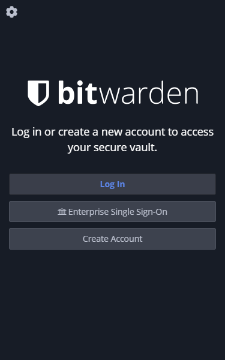
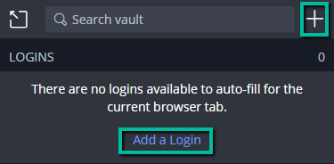
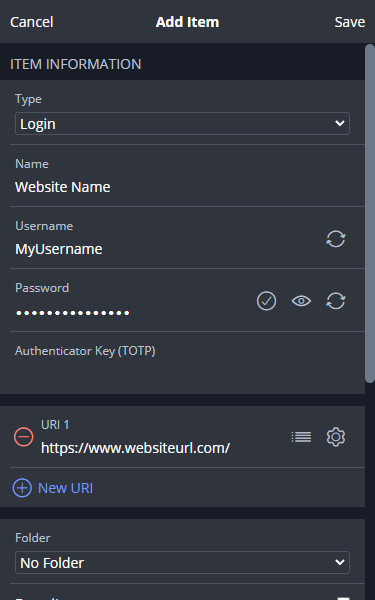
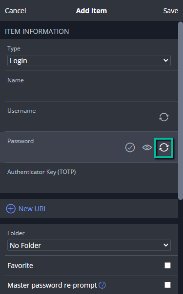
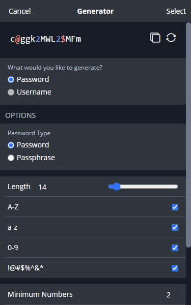
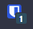
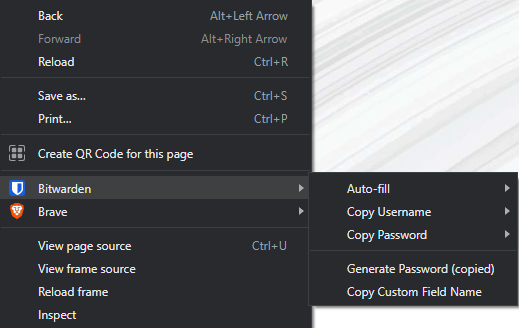

# Getting Started
 
## Overview
This guide walks through the process of getting started with the password manager [Bitwarden](https://bitwarden.com/). At the end of this guide, users will have installed the Bitwarden extension in a supported browser, created an account, added login credentials to their vault, generated a secure password, and used the autofill feature.
 
## Installing Bitwarden

Bitwarden is available to install as a desktop application, browser extension, and mobile app. Bitwarden browser extensions are supported for Google Chrome, Mozilla Firefox, Microsoft Edge, Safari, Brave, Opera, Tor, and Vivaldi. Download the Bitwarden browser extension from your browser's app store or marketplace, or from the [Bitwarden Downloads](https://bitwarden.com/download/) page.

Browser requirements and detailed instructions for installing Bitwarden can be found in the [Installation Guide](installation.md).

## Creating an Account

Click the Bitwarden logo { width="30" } in your browser's toolbar and click <strong>Create Account</strong>.

Enter your email address, master password, and a hint to help recover your master password (optional, but recommended). Your master password is what you will use to log in to Bitwarden and access your Bitwarden Vault. 

!!! warning 

    Your master password cannot be recovered if forgotten, so it should be something secure but also easy to remember.

Check the box to agree to the Terms of Service and Privacy Policy, then click <strong>Submit</strong>.

## Adding Credentials to the Vault

Click the Bitwarden logo { width="30" } in your browser's toolbar and click the plus :fa-plus: icon to Add an Item or click the link <strong>Add a Login</strong>.

Complete the Name, Username, and Password fields and click <strong>Save</strong>.

## Generating Passwords

When adding a login, you have the option to let Bitwarden generate a random, secure password for you.

In the Password field, click the rotating arrows.

Use the available options to make your password or passphrase as complex as you'd like, and use the rotating arrows to generate new passwords or passphrases.

Click <strong>Select</strong>, and your password or passphrase will populate the Password field in the Add Item form. Click <strong>Save</strong> to save your changes.

## Using the Auto-fill Feature

If you have added login credentials for a website to your Bitwarden Vault, you have the option to let Birtwarden auto-fill your credentials for you.

Click the Bitwarden logo { width="30" } in your browser's toolbar to verify you are logged in.

Navigate to the website you need to log in to.

If you have added login credentials for the website, a number will appear over the logo showing the number of credentials you have saved for that website.

{ height="50" }

Click the Bitwarden logo and select the item listed under Logins. Your credentials will autopopulate in the Username and Password fields on the website.

You can also right-click inside of the Username or Password field on the website, hover your mouse over Bitwarden, hover your mouse over Auto-fill, and select your credentials.

